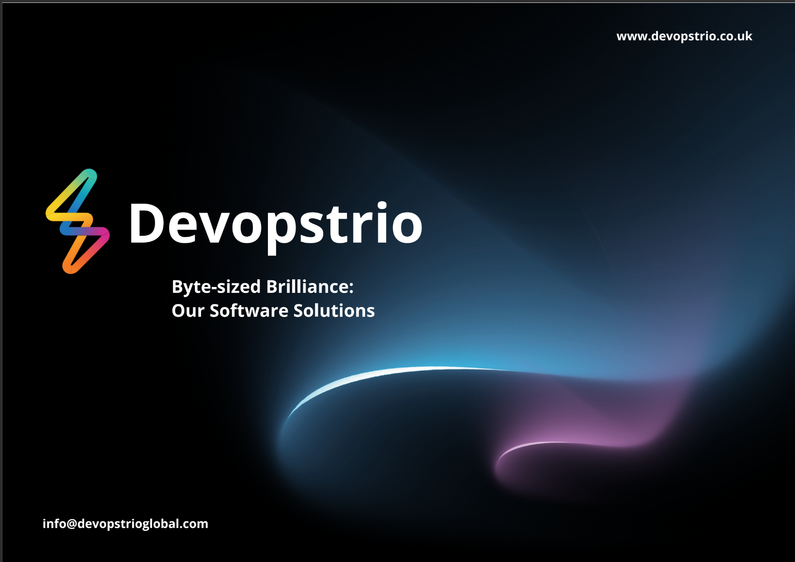
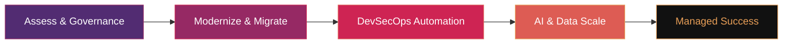

<h1>Devopstrio</h1>

<strong>Enterprise Cloud &nbsp;&middot;&nbsp; AI &nbsp;&middot;&nbsp; DevOps Acceleration</strong>

 

> **Building the future of enterprise infrastructure &mdash; one blueprint at a time.**
> 
> 180+ open-source accelerators &nbsp;&middot;&nbsp; 15 technology domains &nbsp;&middot;&nbsp; 3 cloud providers &nbsp;&middot;&nbsp; 100% production-grade

---

## Our Website

**[Homepage](https://devopstrio.co.uk/) &nbsp;&nbsp;•&nbsp;&nbsp; [Services](https://devopstrio.co.uk/services) &nbsp;&nbsp;•&nbsp;&nbsp; [Repos](https://devopstrio.co.uk/repos) &nbsp;&nbsp;•&nbsp;&nbsp; [Insights](https://devopstrio.co.uk/insights) &nbsp;&nbsp;•&nbsp;&nbsp; [About](https://devopstrio.co.uk/about) &nbsp;&nbsp;•&nbsp;&nbsp; [Contact](https://devopstrio.co.uk/contact)**

---

## Our Transformation Methodology

---

## Our Services

<table>
<tr>
<td width="50%">

### Enterprise Landing Zone
CAF-aligned multi-cloud governance foundations with policy-as-code and subscription vending.

- Multi-tenant Governance
- Network Segmentation
- Identity Integration

[**Explore**](https://devopstrio.co.uk/#services)

</td>
<td width="50%">

### AI Landing Zone
GenAI-ready secure OpenAI, Bedrock & Vertex AI deployment with enterprise RAG pipelines.

- Enterprise RAG Ready
- AI Governance & Safety
- Scalable LLM Pipelines

[**Explore**](https://devopstrio.co.uk/#services)

</td>
</tr>
<tr>
<td width="50%">

### Data Landing Zone
Lakehouse architectures with Microsoft Fabric, Databricks & Snowflake for real-time analytics.

- Real-time Analytics
- Data Mesh Patterns
- Automated Governance

[**Explore**](https://devopstrio.co.uk/#services)

</td>
<td width="50%">

### Security & Compliance
Zero Trust architecture, IAM blueprints & Defender suite automation aligned to CIS and NIST.

- Zero Trust Model
- Compliance Automation
- DevSecOps Pipelines

[**Explore**](https://devopstrio.co.uk/#services)

</td>
</tr>
</table>

---

## Multicloud Excellence

| Platform | Specialization |
| :--- | :--- |
| Azure | Enterprise Landing Zones (ALZ), AKS Hub-Spoke, Microsoft Fabric Foundations |
| AWS | Control Tower customization, EKS Blueprints, Serverless architectures |
| GCP | Anthos modernization and secure GKE foundations |

---

## 🚀 Top 20 Flagship Accelerators

| # | Domain | Repository | Strategic Focus |
| :--- | :--- | :--- | :--- |
| 1 | **Platform** | [enterprise-platform-accelerator](https://github.com/Devopstrio/enterprise-platform-accelerator) | Internal Developer Platform (IDP) Foundation |
| 2 | **AI** | [ai-landing-zone](https://github.com/Devopstrio/ai-landing-zone) | Enterprise AI & GenAI Landing Zone |
| 3 | **Data** | [data-landingzone](https://github.com/Devopstrio/data-landingzone) | Lakehouse & Data Mesh Reference Architecture |
| 4 | **Application** | [app-landingzone](https://github.com/Devopstrio/app-landingzone) | Compliant Application Workload Hosting |
| 5 | **DevOps** | [devops-platform](https://github.com/Devopstrio/devops-platform) | Scalable GitHub/ADO Platform Engineering |
| 6 | **Security** | [zero-trust-reference](https://github.com/Devopstrio/zero-trust-reference) | Multi-Cloud Zero Trust Reference Model |
| 7 | **Compliance** | [compliance-as-code](https://github.com/Devopstrio/compliance-as-code) | Automated SOC2, ISO, HIPAA Governance |
| 8 | **FinOps** | [finops-foundation](https://github.com/Devopstrio/finops-foundation) | Cloud Economics & Cost Optimization |
| 9 | **Ops** | [operations-landingzone](https://github.com/Devopstrio/operations-landingzone) | Unified Observability & Monitoring Hub |
| 10 | **Network** | [network-landingzone](https://github.com/Devopstrio/network-landingzone) | Global Hub-and-Spoke Networking |
| 11 | **Identity** | [identity-landingzone](https://github.com/Devopstrio/identity-landingzone) | IAM Federation & Lifecycle Foundation |
| 12 | **AVD** | [avd-landingzone](https://github.com/Devopstrio/avd-landingzone) | Production-ready Virtual Desktop LZ |
| 13 | **Hybrid** | [migration-factory](https://github.com/Devopstrio/migration-factory) | Large-scale Migration Orchestration |
| 14 | **BCDR** | [bcdr-landingzone](https://github.com/Devopstrio/bcdr-landingzone) | Enterprise Resilience & Disaster Recovery |
| 15 | **Industry** | [financial-services-lz](https://github.com/Devopstrio/financial-services-lz) | FSI-compliant Control Baselines |
| 16 | **AI** | [genai-gateway](https://github.com/Devopstrio/genai-gateway) | Secure LLM API Gateway |
| 17 | **Data** | [data-mesh-reference](https://github.com/Devopstrio/data-mesh-reference) | Federated Data Governance Patterns |
| 18 | **DevOps** | [devsecops-template](https://github.com/Devopstrio/devsecops-template) | Secure CI/CD Lifecycle Pipelines |
| 19 | **Security** | [cloud-security-benchmark](https://github.com/Devopstrio/cloud-security-benchmark) | Automated CIS & NIST Security Audits |
| 20 | **AVD** | [avd-onboarding-accelerator](https://github.com/Devopstrio/avd-onboarding-accelerator) | Scripted VDI Onboarding in <2 Hours |

---

## Trusted Partnerships & Ecosystem

  

### *Three pillars form our strength—People, Process, and Technology.*
### *Three domains shape our focus—Cloud, Data, and AI.*
**Across Azure, AWS, and GCP, we bring innovation to life. At Devopstrio, we unite DevOps and automation to modernise infrastructure and accelerate digital success.**

  

---

## Company Profile

---

## Get In Touch

<table>
<tr>
<td width="33%" valign="top">

**Contact Details**
- **Phone:** +44 1784 64 0216
- **Web:** [devopstrio.co.uk](https://devopstrio.co.uk)
- **Email:** [info@devopstrioglobal.com](mailto:info@devopstrioglobal.com)

**Address**
United Kingdom,  
128 City Road, London,  
EC1V 2NX

</td>
<td width="33%" valign="top">

**Social Media**
- [**LinkedIn**](https://www.linkedin.com/company/devopstrioglobal/)
- [**Instagram**](https://instagram.com/devopstrio_offcl)
- [**Facebook**](https://facebook.com/devopstrio)

**Global Presence**
- **HQ:** London, UK
- **Offices:** NY (USA), Chennai & Bangalore (India)

</td>
<td width="33%" valign="top">

**Delivery & Operations**
- **Model:** Hybrid (Onshore + Offshore)
- **Support:** 24x7 Global Operations
- **Compliance:** GDPR, HIPAA, ISO 27001

</td>
</tr>
</table>

### LET'S DO SOMETHING AMAZING.

  
**Devopstrio**

---

**[Back to Top](#devopstrio)** &nbsp;&nbsp;•&nbsp;&nbsp; **[Our Repositories](https://github.com/orgs/devopstrio/repositories)** &nbsp;&nbsp;•&nbsp;&nbsp; **[Contact Us](mailto:info@devopstrioglobal.com)**

