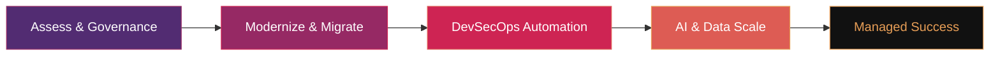

<h1>Devopstrio</h1>

<strong>Enterprise Cloud &nbsp;&middot;&nbsp; AI &nbsp;&middot;&nbsp; DevOps Acceleration</strong>

  

 

> **Building the future of enterprise infrastructure &mdash; one blueprint at a time.**
> 
> 180+ open-source accelerators &nbsp;&middot;&nbsp; 15 technology domains &nbsp;&middot;&nbsp; 3 cloud providers &nbsp;&middot;&nbsp; 100% production-grade

---

## Our Website

**[Homepage](https://devopstrio.co.uk/) &nbsp;&nbsp;•&nbsp;&nbsp; [Services](https://devopstrio.co.uk/services) &nbsp;&nbsp;•&nbsp;&nbsp; [Repos](https://devopstrio.co.uk/repos) &nbsp;&nbsp;•&nbsp;&nbsp; [Insights](https://devopstrio.co.uk/insights) &nbsp;&nbsp;•&nbsp;&nbsp; [About](https://devopstrio.co.uk/about) &nbsp;&nbsp;•&nbsp;&nbsp; [Contact](https://devopstrio.co.uk/contact)**

---

## Our Transformation Methodology

---

## Our Services

<table>
<tr>
<td width="50%">

### Enterprise Landing Zone
CAF-aligned multi-cloud governance foundations with policy-as-code and subscription vending.

- Multi-tenant Governance
- Network Segmentation
- Identity Integration

[**Explore**](https://devopstrio.co.uk/#services)

</td>
<td width="50%">

### AI Landing Zone
GenAI-ready secure OpenAI, Bedrock & Vertex AI deployment with enterprise RAG pipelines.

- Enterprise RAG Ready
- AI Governance & Safety
- Scalable LLM Pipelines

[**Explore**](https://devopstrio.co.uk/#services)

</td>
</tr>
<tr>
<td width="50%">

### Data Landing Zone
Lakehouse architectures with Microsoft Fabric, Databricks & Snowflake for real-time analytics.

- Real-time Analytics
- Data Mesh Patterns
- Automated Governance

[**Explore**](https://devopstrio.co.uk/#services)

</td>
<td width="50%">

### Security & Compliance
Zero Trust architecture, IAM blueprints & Defender suite automation aligned to CIS and NIST.

- Zero Trust Model
- Compliance Automation
- DevSecOps Pipelines

[**Explore**](https://devopstrio.co.uk/#services)

</td>
</tr>
</table>

---

## Multicloud Excellence

| Platform | Specialization |
| :--- | :--- |
| Azure | Enterprise Landing Zones (ALZ), AKS Hub-Spoke, Microsoft Fabric Foundations |
| AWS | Control Tower customization, EKS Blueprints, Serverless architectures |
| GCP | Anthos modernization and secure GKE foundations |

---

## Flagship Open-Source Repositories

| Domain | Repository | Strategic Value |
| :--- | :--- | :--- |
| **Strategy** | [devopstrio-landing-zone](https://github.com/Devopstrio/devopstrio-landing-zone) | Multi-cloud governance & orchestration blueprint |
| **Networking** | [terraform-enterprise-networking](https://github.com/Devopstrio/terraform-enterprise-networking) | High-availability hub-and-spoke security mesh |
| **AI** | [azure-openai-secure-reference](https://github.com/Devopstrio/azure-openai-secure-reference) | Privacy-first enterprise GenAI infrastructure |
| **Kubernetes** | [aks-production-foundation](https://github.com/Devopstrio/aks-production-foundation) | Production-hardened AKS cluster orchestration |
| **FinOps** | [cloud-finops-dashboard](https://github.com/Devopstrio/cloud-finops-dashboard) | Real-time cloud cost transparency & automation |
| **Security** | [security-baselines](https://github.com/Devopstrio/security-baselines) | CIS & NIST-aligned zero-trust remediation |
| **Data** | [data-lakehouse-blueprint](https://github.com/Devopstrio/data-lakehouse-blueprint) | Medallion architecture on Fabric & Databricks |

---

## Comprehensive Landing Zone Portfolio

| Sector / Domain | Repository Accelerator | Strategic Operational Focus |
| :--- | :--- | :--- |
| **Foundation** | [enterprise-landing-zone](https://github.com/Devopstrio/enterprise-landing-zone) | CAF-aligned multi-cloud governance foundation |
| **Network** | [zero-trust-network-lz](https://github.com/Devopstrio/zero-trust-network-lz) | Identity-driven network isolation & inspection |
| **AI** | [ai-landing-zone](https://github.com/Devopstrio/ai-landing-zone) | Secure GenAI & RAG infrastructure orchestration |
| **Data** | [data-landingzone](https://github.com/Devopstrio/data-landingzone) | Scalable Lakehouse & Analytics domain zones |
| **Workload** | [workload-landingzone-iac](https://github.com/Devopstrio/workload-landingzone-iac) | Application-centric provisioning & guardrails |
| **Identity** | [identity-landingzone](https://github.com/Devopstrio/identity-landingzone) | Centralized Entra ID & IAM global governance |
| **Hybrid** | [hybrid-landingzone](https://github.com/Devopstrio/hybrid-landingzone) | Seamless on-prem, edge & multi-cloud integration |
| **VDI** | [avd-landingzone](https://github.com/Devopstrio/avd-landingzone) | Production-ready Azure Virtual Desktop (AVD) |
| **Telecom** | [telecom-lz](https://github.com/Devopstrio/telecom-lz) | Carrier-grade 5G & edge compute foundations |
| **Finance** | [financial-services-lz](https://github.com/Devopstrio/financial-services-lz) | FSI-compliant secure zones & regulatory controls |
| **Government** | [government-lz](https://github.com/Devopstrio/government-lz) | Sovereignty, FedRAMP & high-security baselines |
| **Healthcare** | [healthcare-lz](https://github.com/Devopstrio/healthcare-lz) | HIPAA-aligned medical data & HITRUST zones |
| **Automotive** | [automotive-lz](https://github.com/Devopstrio/automotive-lz) | Connected vehicle & manufacturing edge mesh |
| **Retail** | [retail-lz](https://github.com/Devopstrio/retail-lz) | Scalable e-commerce & intelligent store-edge |
| **Energy** | [energy-lz](https://github.com/Devopstrio/energy-lz) | Smart-grid & critical infrastructure security |
| **Sustainability** | [sustainability-lz](https://github.com/Devopstrio/sustainability-lz) | Green-ops & carbon-aware cloud infrastructure |

[**View All 180+ Repositories**](https://github.com/orgs/devopstrio/repositories)

---

## Trusted Partnerships & Ecosystem

  

### *Three pillars form our strength—People, Process, and Technology.*
### *Three domains shape our focus—Cloud, Data, and AI.*
**Across Azure, AWS, and GCP, we bring innovation to life. At Devopstrio, we unite DevOps and automation to modernise infrastructure and accelerate digital success.**

  

---

## Company Profile

---

## Get In Touch

<table>
<tr>
<td width="33%" valign="top">

**Contact Details**
- **Phone:** +44 1784 64 0216
- **Web:** [devopstrio.co.uk](https://devopstrio.co.uk)
- **Email:** [info@devopstrioglobal.com](mailto:info@devopstrioglobal.com)

**Address**
United Kingdom,  
128 City Road, London,  
EC1V 2NX

</td>
<td width="33%" valign="top">

**Social Media**
- [**LinkedIn**](https://www.linkedin.com/company/devopstrioglobal/)
- [**Instagram**](https://instagram.com/devopstrio_offcl)
- [**Facebook**](https://facebook.com/devopstrio)

**Global Presence**
- **HQ:** London, UK
- **Offices:** NY (USA), Chennai & Bangalore (India)

</td>
<td width="33%" valign="top">

**Delivery & Operations**
- **Model:** Hybrid (Onshore + Offshore)
- **Support:** 24x7 Global Operations
- **Compliance:** GDPR, HIPAA, ISO 27001

</td>
</tr>
</table>

 

### *Innovate with Confidence. Scale with Precision.*

**Devopstrio Acceleration Partner**  
*The standard for enterprise cloud, data, and AI transformation.*

 

---

**[Back to Top](#devopstrio)** &nbsp;&nbsp;•&nbsp;&nbsp; **[Our Repositories](https://github.com/orgs/devopstrio/repositories)** &nbsp;&nbsp;•&nbsp;&nbsp; **[Contact Us](mailto:info@devopstrioglobal.com)**

